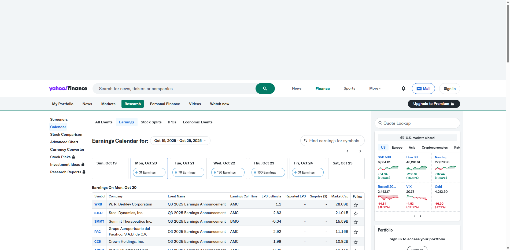

# Earnings Calendar Momentum Analyzer

This application analyzes stock price momentum based on earnings calendar events to identify true long-term winners. It fetches tickers with earnings announcements from Yahoo Finance and applies sophisticated filtering to find companies with sustained growth momentum - stocks that have performed well over multiple time horizons, indicating consistent investor confidence.

## 🆕 Latest Enhancements

### Advanced Date Filtering Options
- **Single Date Analysis**: Traditional single-day earnings analysis
- **Date Range Analysis**: Analyze earnings across multiple consecutive days
- **Multiple Specific Dates**: Cherry-pick specific dates for targeted analysis
- **Smart Date Validation**: Business day warnings and date range validation
- **Comprehensive Progress Tracking**: Real-time updates across multiple dates

## Key Philosophy

**Finding True Momentum Winners**: If a stock grows year-over-year for 5 years, it must be a winner. This tool helps identify companies where investors consistently trust the business fundamentals by filtering for stocks where 5-year performance exceeds 1-year performance - indicating sustained, long-term growth rather than just recent volatility.

## Features

### 🎯 Momentum Filtering
- **Primary Filter**: User-defined percentage threshold for initial screening
- **Momentum Filter**: Advanced filter requiring 5-year performance > 1-year performance
- **True Winners**: Only companies passing both filters are highlighted as top momentum picks

### 📊 Rich Visual Analysis  
- **Interactive Cards**: Detailed company profiles for filtered winners (see screenshot below)
- **5-Year Price Charts**: Visual momentum trends for each top pick
- **Company Intelligence**: Business summaries, sector/industry classification, key metrics
- **Performance Metrics**: Clear display of 1-year vs 5-year performance comparison
- **Multi-Date Breakdown**: Visual table showing ticker counts and samples per selected date


*Enhanced multi-date processing showing breakdown by date with real-time progress tracking*


*Example of detailed company cards showing momentum winners with 5-year charts and business intelligence*

### 📈 Data-Driven Insights
- Automatic pagination to retrieve all tickers from earnings calendar
- Real-time performance calculations across multiple time periods (1mo, 3mo, 6mo, 1y, 2y, 5y)
- Comprehensive company data: market cap, employees, sector, industry, website
- Export capabilities with CSV downloads for both filtered and all winners
- **Multi-date aggregation**: Combine unique tickers across selected date ranges
- **Per-date breakdown**: Visual analysis of ticker distribution across dates

### 🚀 Time-Saving Efficiency
This tool eliminates the need to manually review tickers one-by-one. Instead of spending hours researching individual stocks from earnings calendars, you get:
- **Flexible Date Selection**: Single dates, ranges, or multiple specific dates
- Automated momentum screening across hundreds of tickers
- Pre-filtered results showing only companies with sustained growth
- Rich company context for quick investment decision making
- Visual momentum trends to spot consistent performers
- **Batch Processing**: Analyze multiple earning periods simultaneously

## Features Summary
- **Multi-Date Analysis**: Single dates, date ranges, or multiple specific dates
- **Smart Date Validation**: Business day analysis and weekend warnings
- **Enhanced Progress Tracking**: Real-time updates across multiple processing stages
- **Per-Date Breakdown**: Visual analysis of ticker distribution across selected dates
- **Momentum Filtering**: Advanced dual-filter system (threshold + 5Y > 1Y performance)
- **Rich Company Intelligence**: Business summaries, charts, and key metrics
- **Flexible Export Options**: Date-range aware CSV downloads
- **Interactive UI**: Streamlined controls with session state management
- **Batch Processing Efficiency**: Analyze hundreds of tickers across multiple dates

## Installation

### Prerequisites
- Python 3.7 or higher
- pip (Python package installer)
- Google Chrome browser (for web scraping)

### Steps
1. Clone the repository:
    ```bash
    git clone https://github.com/nealm682/Investor.git
    cd Investor
    ```

2. Create a virtual environment (recommended):
    ```powershell
    # Windows PowerShell
    python -m venv venv
    .\venv\Scripts\Activate.ps1
    ```

3. Install the required packages:
    ```powershell
    pip install -r requirements.txt
    ```

4. ChromeDriver setup:
    - Ensure Google Chrome is installed on your system
    - ChromeDriver is managed automatically by `webdriver-manager`

## Usage
1. Run the momentum analyzer:
    ```powershell
    streamlit run earnings.py
    ```

2. Open the app in your browser (usually at `http://localhost:8501`).

3. **Enhanced Date Selection** - Choose your filtering approach:
    - **Single Date**: Traditional single-day analysis for focused research
    - **Date Range**: Select start/end dates for comprehensive multi-day analysis  
    - **Multiple Specific Dates**: Add up to 10 specific dates for targeted screening

4. Configure your momentum screening:
    - **Time Period**: Pick your analysis timeframe (1mo to 5y)
    - **Threshold**: Set percentage gain threshold for initial filtering

5. **Analyze**: Click to start the momentum screening process with enhanced progress tracking

6. Review Enhanced Results:
    - **Multi-Date Summary**: See breakdown of tickers found per date
    - **Summary Statistics**: View how many tickers pass each filter across all dates
    - **Filtered Winners**: Download CSV of momentum winners (5Y > 1Y performance)
    - **All Winners**: Download CSV of all tickers meeting threshold
    - **Detailed Cards**: Scroll down for rich company profiles with charts and business intelligence

## How It Works

This tool scrapes the Yahoo Finance Earnings Calendar (shown below) to identify companies with earnings announcements, then applies sophisticated momentum analysis.


*Yahoo Finance Earnings Calendar - Source of earnings announcement data*

### `fetch_earnings_tickers(specific_date)`
Enhanced earnings calendar scraper:
- Scrapes Yahoo Finance earnings calendar for the specified date using Selenium
- Identifies the earnings table by checking for specific header keywords
- Extracts ticker symbols from the table's quote URLs  
- Implements pagination to retrieve all tickers (handles multiple pages)
- **Optimized for batch processing**: Clean, efficient scraping for multiple dates
- Returns a complete list of unique ticker symbols

### Enhanced Multi-Date Processing
**Advanced Date Filtering System**:
- **Single Date Mode**: Traditional focused analysis
- **Date Range Mode**: Automatically generates all dates between start/end with business day analysis
- **Multiple Dates Mode**: Interactive date picker with session management
- **Smart Validation**: Weekend warnings and date range validation
- **Progress Tracking**: Real-time updates across multiple date processing

### `calculate_tickers_change(tickers, percent_change_threshold, time_period)`
Advanced momentum analysis with dual filtering:
- **Primary Screening**: Filters tickers meeting initial percentage threshold over selected period
- **Momentum Analysis**: For potential winners, downloads both 1-year and 5-year historical data
- **Momentum Filter**: Applies sophisticated filter requiring 5-year performance > 1-year performance
- **Returns**: Three DataFrames - all winners, filtered momentum winners, and complete results

### `get_company_info(ticker)` & `create_ticker_card()`
Rich company intelligence gathering:
- Retrieves comprehensive company data via yfinance API
- Business summaries, sector/industry classification, financial metrics
- Creates beautiful visual cards with integrated 5-year price charts
- Handles missing data gracefully with fallback displays

### Enhanced Streamlit UI
- **Advanced Date Selection**: Radio buttons for Single Date, Date Range, or Multiple Specific Dates
- **Smart Date Controls**: Business day analysis, weekend warnings, session state management
- **Enhanced Progress Tracking**: Multi-level progress bars for date processing and ticker analysis
- **Per-Date Breakdown**: Expandable table showing ticker counts and samples per date
- **Dual Result Views**: Summary tables with CSV downloads + detailed visual cards
- **Momentum Insights**: Clear statistics showing filter effectiveness across all selected dates
- **Company Cards**: Rich visual profiles for each momentum winner including:
  - Interactive 5-year price charts
  - Business summaries and key metrics  
  - Sector/industry context
  - Market cap, employee count, website links
- **Intelligent Filename Generation**: Date-range aware CSV export naming

## Key Dependencies
- `streamlit>=1.50.0` - Interactive web application framework
- `selenium==4.36.0` - Web scraping automation for earnings calendar
- `webdriver-manager==4.0.2` - Automatic ChromeDriver management
- `yfinance==0.2.66` - Yahoo Finance API for stock data and company information
- `pandas==2.3.3` - Data manipulation and analysis

See `requirements.txt` for complete list of dependencies.

## Project Structure
```
Investor/
├── earnings.py                       # Enhanced momentum analyzer with multi-date capabilities
├── earnings_ui_filter.py             # Legacy single-date analyzer (maintained for compatibility)
├── requirements.txt                  # Python package dependencies
├── README.md                        # This comprehensive documentation
├── Screenshot 2025-11-09 090533.jpg # UI screenshot showing momentum cards
├── snapshot-processing-tickers.jpg  # Multi-date processing screenshot
├── debug_screenshot.png             # Yahoo Finance Earnings Calendar reference
└── venv/                            # Virtual environment (not tracked in git)
```

## Investment Philosophy

This tool embodies a momentum-based investment philosophy:

**Sustained Growth Indicator**: Companies showing consistent growth over 5 years demonstrate proven business models and management execution. When 5-year performance exceeds 1-year performance, it suggests the company isn't just riding a recent trend but has fundamental strengths.

**Investor Confidence**: Year-over-year growth for 5 consecutive years indicates sustained investor confidence. The market continuously validates the company's value proposition.

**Risk Mitigation**: By filtering out stocks with only recent gains, this approach helps avoid momentum traps and temporary rallies, focusing on companies with proven track records.

**Efficiency**: Instead of manually researching hundreds of earnings-related stocks, this tool automatically identifies the handful with genuine momentum characteristics.

**Multi-Date Power**: The enhanced date filtering allows for sophisticated analysis strategies:
- **Earnings Clusters**: Analyze entire weeks of earnings to catch sector-wide momentum
- **Historical Comparison**: Compare different earning periods to identify consistent performers  
- **Targeted Research**: Cherry-pick specific high-impact earning days for focused analysis

## Known Limitations
- Yahoo Finance may rate-limit requests for large numbers of tickers
- Some company information may be unavailable for newer/smaller companies
- International stocks may have limited English business descriptions
- Requires Google Chrome browser for web scraping functionality
- 5-year historical data may not be available for recent IPOs

## Troubleshooting

**Issue**: Virtual environment activation fails on Windows PowerShell
- **Solution**: Use `.\venv\Scripts\Activate.ps1` instead of just `activate`

**Issue**: ChromeDriver errors
- **Solution**: Ensure Chrome browser is installed and up to date. The app automatically manages ChromeDriver.

**Issue**: No filtered winners found across multiple dates
- **Solution**: Try lowering the percentage threshold or selecting dates with more market activity. Use date range mode to capture more earnings events.

**Issue**: Company information missing in cards  
- **Solution**: This is normal for some tickers. The tool gracefully handles missing data and shows what's available.

**Issue**: Date range processing takes too long
- **Solution**: Consider limiting date ranges to 5-7 business days or use specific dates mode for targeted analysis.

**Issue**: Weekend dates showing warnings
- **Solution**: This is expected - earnings calendars typically have limited activity on weekends. The tool will still process these dates but results may be minimal.

## License
This project is licensed under the MIT License.

## Contributing
Contributions are welcome! Please open an issue or submit a pull request.

## Acknowledgments
- Yahoo Finance for providing earnings calendar and stock price data
- Selenium and Streamlit communities for their excellent tools
- yfinance library for simplified Yahoo Finance API access

---

**Repository**: https://github.com/nealm682/Investor
