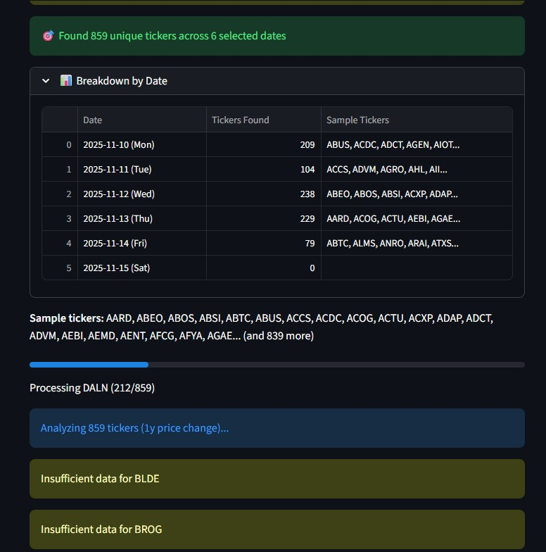

# Investment Analysis Suite

## What This Does

This suite helps you **find high-growth stocks with strong financials** by combining two powerful tools:

1. **Earnings Momentum Analyzer** - Identifies stocks with proven price increases over 24+ months
2. **Financial Health Validator** - Confirms these companies have solid financials to sustain growth

## The Strategy

**Why This Works:**

Many stocks have short-term momentum but lack the fundamentals to sustain growth. This leads to losses when the hype fades. Our two-stage approach solves this:

### Stage 1: Find True Momentum Winners
- Screen stocks reporting earnings (high market attention periods)
- Require **5-year performance > 1-year performance**
- This filters out speculative bubbles and short-term hype
- Result: Companies with **sustained, proven growth**

### Stage 2: Validate Financial Health
- Analyze SEC filings for each momentum winner
- Confirm: Revenue generation, profitability, strong cash position
- Result: **High-growth stocks backed by solid fundamentals**

**The Bottom Line:** You avoid speculative, overbought stocks with poor management and find companies where investors consistently trust the business fundamentals.

---

## Quick Start Guide

### Installation

1. **Clone and setup:**
```powershell
git clone https://github.com/nealm682/Investor.git
cd Investor
python -m venv venv
.\venv\Scripts\Activate.ps1
pip install -r requirements.txt
```

2. **Configure API Keys (Optional but Recommended):**
Create a `.env` file in the project root:
```
SEC_USER_EMAIL=your-email@domain.com
OPENAI_API_KEY=your-openai-api-key
```

**Benefits of API configuration:**
- `SEC_USER_EMAIL`: Required for SEC EDGAR API compliance
- `OPENAI_API_KEY`: Enables AI-powered investment insights and risk analysis

3. **Requirements:**
- Python 3.7+
- Google Chrome browser (for web scraping)
- OpenAI API key (optional, for AI insights)

---

## How To Use

### Step 1: Find Momentum Winners

**Open Terminal 1:**
```powershell
streamlit run earnings_ui_filter.py
```
Opens at: `http://localhost:8501`

**In the app:**
1. **Pick your dates:** 
   - Single date (focused analysis)
   - Date range (comprehensive screening)
   - Multiple specific dates (targeted approach)

2. **Set your filters:**
   - Time period: 1 month to 5 years (recommended: 1-2 years)
   - Threshold: Minimum % gain (e.g., 70%)

3. **Click "Analyze"**

4. **Download CSV:** Export the "Filtered Winners" (stocks where 5Y > 1Y performance)

---

### Step 2: Validate Financial Health

**Open Terminal 2:**
```powershell
streamlit run financials.py --server.port 8502
```
Opens at: `http://localhost:8502`

---

### Step 3 (Optional): 8-Quarter Deep Dive Analysis

For detailed trend analysis of individual companies:

**Open Terminal 3:**
```powershell
streamlit run quarterly_insights.py --server.port 8503
```
Opens at: `http://localhost:8503`

**Features:**
- 17 financial metrics over 8 quarters (2 years)
- Automated MD&A extraction from SEC 10-K/10-Q filings
- AI-powered trend analysis and pattern detection
- Interactive line charts showing metric evolution
- Export all metrics to CSV

**In the app:**
1. **Enter ticker symbol** (e.g., AAPL, SOFI, PLTR)
2. **Configure options:**
   - Include MD&A insights (management commentary)
   - AI trend analysis (pattern detection)
   - Export to CSV

3. **Click "Analyze 8 Quarters"** (takes 30-60 seconds)

4. **Review across 6 tabs:**
   - 📊 Overview - Key metrics and summary trends
   - 📈 Growth - Revenue, growth rate, EPS
   - 💰 Profitability - Income breakdown and margins
   - 💵 Cash Flow - OCF, CapEx, Free Cash Flow
   - 🏦 Balance Sheet - Cash, debt, working capital
   - 🤖 AI Insights - Trend analysis and MD&A highlights

---

**In the app:**
1. **Upload CSV:** The filtered winners CSV from Step 1

2. **Configure:**
   - Max companies: 5-10 for quick analysis, up to 20 for comprehensive
   - Enable detailed metrics for deeper insights

3. **Click "Start Analysis"**
   - ⚠️ Takes 2-5 minutes due to SEC rate limits

4. **Review Results:**
   - ✅ **Revenue Generating** - Company making money
   - ✅ **Profitable** - Company earning profit
   - ✅ **Strong Cash Position** - Cash > Debt or high cash reserves
   - 📊 **Quarterly Trends** - See revenue/profit trajectory
   - 🤖 **AI Analyst Insights** - Intelligent commentary on risks, limitations, and suitability

---

## 🤖 AI-Powered Insights (New!)

When configured with OpenAI API key, the tool provides:

### **Intelligent Commentary On:**
- **Investment Risks** - Debt concerns, burn rate, profitability issues
- **Data Quality** - Missing metrics, date mismatches, XBRL limitations
- **Retirement Suitability** - Conservative assessment for long-term investors

### **Key Benefits:**
- 🎯 **Focused Analysis** - Concise, retirement-focused insights (200 words max)
- ⚠️ **Risk-First Approach** - Highlights concerns before opportunities
- 📊 **Context-Aware** - Analyzes actual SEC data quality issues
- 💡 **Plain English** - No jargon, direct communication

### **Example AI Insights:**
```
⚠️ High Risk Investment: Company burning $455M quarterly with only 
$711M cash runway (~1.6 quarters). While revenue growing (+26%), 
massive net losses from warrant revaluation ($424M) indicate high 
volatility.

🔍 Data Concern: Convertible debt ($1.06B) detected, but warrant 
liabilities ($839M additional) not captured in traditional debt 
metrics - true leverage higher than reported.

🛡️ Retirement Portfolio: NOT SUITABLE. Extreme volatility and 
negative cash flow make this speculative, not appropriate for 
conservative retirement investing.
```

---

## What The Results Mean

### Green Flags (Buy Signals)
- ✅ All three health indicators pass
- 📈 Quarterly revenue trending upward
- 💰 Positive and growing net income
- 🏦 Cash exceeds debt

### Yellow Flags (Research Further)
- ⚠️ 2 out of 3 indicators pass
- Revenue growing but not yet profitable (growth stage)
- Check quarterly trends for improvement

### Red Flags (Avoid)
- ❌ Not revenue generating
- ❌ Unprofitable with declining trends
- ❌ Debt concerns (debt >> cash)
- 📉 Declining quarterly revenues

---

## Real-World Example

**Scenario:** Earnings calendar for November 10-15, 2025

1. **Stage 1 Results:** 859 tickers → 150 exceed threshold → 47 pass momentum filter (5Y > 1Y)
   
2. **Stage 2 Analysis:** Upload 47 filtered winners
   - 28 companies revenue generating
   - 22 companies profitable
   - 15 companies with strong cash position
   - **Final picks:** 12 stocks with all three ✅

3. **Outcome:** You identified 12 high-growth stocks with proven momentum AND solid financials, avoiding 835+ speculative plays.

---

## Tips for Success

### Date Selection
- **Earnings dates** have high market attention
- **Weekdays only** - weekends have minimal activity
- **Multiple dates** capture more opportunities

### Time Periods
- **1-2 years** = recent strong performers
- **5 years** = long-term consistency check
- **Momentum filter** = ensures sustained growth (not a pump-and-dump)

### Analysis Limits
- **Start with 5-10 companies** for quick insights
- **Max 20** for comprehensive review (API rate limits)
- Focus on companies with all three health indicators

### CSV Workflow
- Export from earnings.py → Import to financials.py
- Keep CSV organized by date range
- Re-analyze periodically as new earnings reports come out

---

## Troubleshooting

**Chrome/Selenium Issues:**
- Ensure Chrome browser is installed
- ChromeDriver auto-updates via webdriver-manager

**SEC API Rate Limits:**
- Analysis is intentionally slow (10 requests/sec max)
- Don't interrupt - let it complete
- If it fails, reduce company count and retry

**No Data Found:**
- Check date selection (avoid weekends)
- Lower percentage threshold
- Verify internet connection

**CSV Upload Fails:**
- Ensure CSV from earnings.py (contains 'Momentum Filter ✓' column)
- Check file isn't open in Excel

---

## Why This Matters

Traditional stock picking is time-consuming and error-prone. You might:
- Chase short-term momentum (get burned)
- Miss financial red flags (poor management)
- Waste hours researching manually

This suite automates the hard work:
- ⚡ Screens hundreds of stocks in minutes
- 🎯 Applies proven momentum filters
- 📊 Validates with official SEC data
- 💡 Presents clear buy signals

**Result:** Make informed decisions faster, backed by data, not hype.

---

## Screenshots


*Processing 859 tickers across 6 earnings dates*


*Detailed cards for filtered winners with 5-year charts*


*SEC financial analysis showing health indicators*

---

## Need More Detail?

For technical documentation, API details, and advanced usage, see the original [README.md](README.md).

For SEC EDGAR API reference, see [sec_edgar.md](sec_edgar.md).